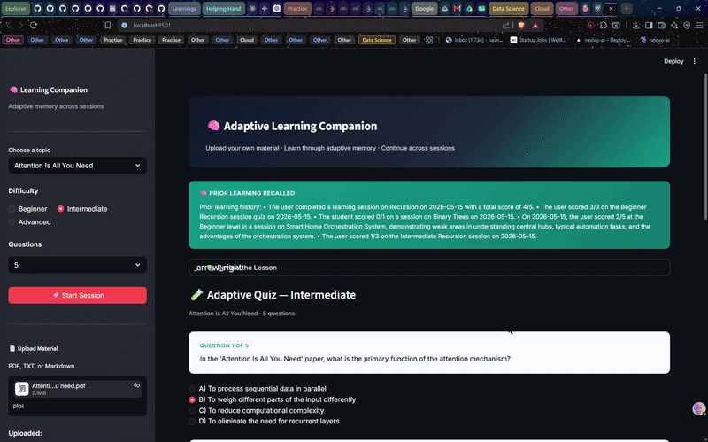
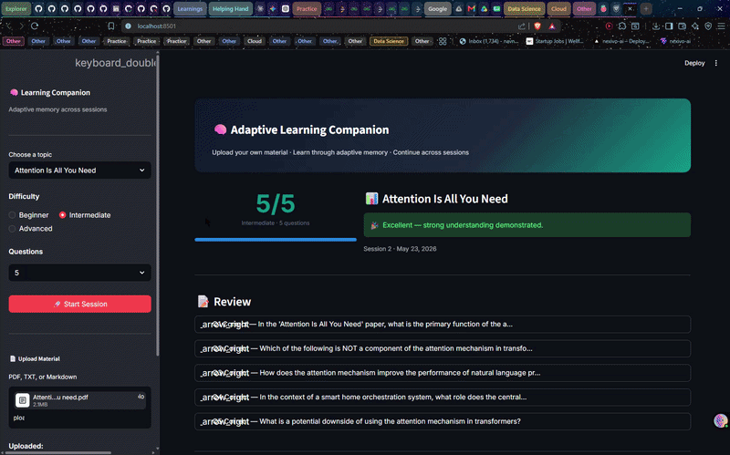
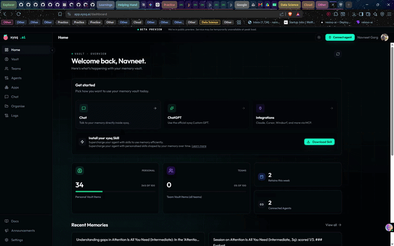

<div align="center">

# 🧠 Adaptive Learning Companion

**The AI remembers how you learn.**

Upload your study material. Learn through adaptive quizzes.
Come back tomorrow — the system still knows where you left off.

[](https://www.python.org/downloads/)
[](https://crewai.com)
[](https://xysq.ai)
[](https://aws.amazon.com/bedrock/)
[](https://ai.google.dev/)
[](https://openai.com/)
[](LICENSE)

</div>

<br>

## See it in action

<!-- 🎬 Hero Demo Video Placeholder -->
<!-- Replace this image with a high-quality GIF showing:
     1. Uploading "Attention Is All You Need" paper
     2. Selecting topic, difficulty, and question count
     3. The learning session starting seamlessly
-->
<div align="center">
  
  <p><em>A 60-second walkthrough showing how uploaded research papers become part of a persistent, adaptive learning workspace.</em></p>
</div>

<br>

Your uploaded material doesn't disappear after the session.
It becomes part of every future learning interaction — surfacing in lessons, shaping quizzes, and informing progress reports.

<br>

---

<br>

## The problem

Most AI learning tools have amnesia.

You upload notes. You answer questions. You close the tab.
Next time? The AI has no idea you were ever there.

Every session starts from zero.

<br>

## Why continuity matters

Real learning is cumulative.

A tutor who remembers that you struggled with attention mechanisms last week
will teach differently today. That's the difference between a chatbot and a learning system.

This project gives AI agents **persistent memory** — powered by [xysq](https://xysq.ai).

- Upload a research paper on Monday. The AI still references it on Friday.
- Score 2/5 on self-attention. Next session targets exactly those gaps.
- Kill the process. Restart the server. The memory survives.

No database to manage. No conversation logs to replay.
The AI simply remembers.

<br>

---

<br>

## What it does

| | |
|---|---|
| 🎯 **Adaptive quizzes** | Difficulty adjusts based on how you've performed before |
| 📚 **Persistent knowledge** | Uploaded PDFs, notes, and papers become permanent learning material |
| 🧠 **Cross-session memory** | Quiz scores, weak areas, and understanding gaps survive restarts |
| 📊 **Progress reports** | Detailed analysis with trend tracking and next-step recommendations |
| 🔄 **Evolving difficulty** | The system suggests when you're ready to move up |
| 📄 **Document understanding** | Uploaded content is extracted, indexed, and referenced in future sessions |

<br>

---

<br>

## Adaptive learning in practice

<!-- 🎬 Learning + Quiz Flow Demo Video Placeholder -->
<!-- Replace this image with a high-quality GIF showing:
     1. Lesson generation and adaptive quiz taking
     2. Real-time feedback and evaluation
     3. Improvement suggestions
-->
<div align="center">
  
  <p><em>A walkthrough of a full learning session showing adaptive quiz generation, interactive answers, and AI-driven performance evaluation.</em></p>
</div>

Here's what a typical session looks like:

**1.** You pick a topic — say, the Transformer architecture from a paper you uploaded earlier.

**2.** The AI recalls what you know. If you've studied this before, it remembers where you struggled.

**3.** A lesson is generated — adapted to your level and your gaps.

**4.** You take a quiz. The questions aren't random — they probe the areas where you're weakest.

**5.** After submitting, the AI evaluates every answer. Not just right or wrong — it explains *why*, identifies conceptual gaps, and suggests what to focus on next.

**6.** Everything is stored. Next time you revisit this topic, the system picks up exactly where you left off.

<br>

---

<br>

## Memory that outlasts the session

<!-- 🎬 xysq Memory Continuity Demo Video Placeholder -->
<!-- Replace this image with a high-quality GIF showing:
     1. xysq vault storing the session outcome
     2. Starting a NEW session later
     3. The "Prior Learning Recalled" card appearing automatically
-->
<div align="center">
  
  <p><em>Showing how xysq stores learning history and session outcomes in a persistent vault that future sessions draw from automatically.</em></p>
</div>

This is the core of the system.

When you finish a learning session, the AI doesn't just show you a score.
It stores structured learning data — what you got wrong, which concepts you're improving on, what difficulty you're ready for.

When you come back — hours, days, or weeks later — that data is recalled automatically.

```
Session 1 (Monday)             Session 2 (Thursday)
──────────────────             ────────────────────
Upload: attention paper        AI recalls: "struggled with
Score: 2/5 on self-attention     multi-head attention"
Gaps stored → xysq             Quiz targets those exact gaps
                               Score: 4/5
                               Progress stored → xysq
```

No shared runtime between sessions. No conversation replay.
The memory layer operates independently of the application lifecycle.

**Kill the process. Redeploy. Crash. Come back.**
The learner profile persists.

<br>

---

<br>

## Architecture

```
┌─────────────────────────────────────────────┐
│           React / Vite Frontend             │
│    Topic · Difficulty · Quiz · Progress     │
└──────────────────┬──────────────────────────┘
                   │
        ┌──────────┴────────────┐
        │  FastAPI Backend API  │
        └──────────┬────────────┘
                   │
        ┌──────────┴────────────┐
        │     CrewAI Agents     │
        │ Tutor · Quiz · Analyst│
        └──────────┬────────────┘  
                   │
    ┌──────────────┼────────────┐
    │              │            │
┌───┴───┐   ┌──────┴─────┐  ┌───┴─────┐
│ xysq  │   │  xysq      │  │ AI      │
│Memory │   │ Organise   │  │Provider │
│       │   │            │  │         │
│capture│   │  upload    │  │         │
│surface│   │  extract   │  │         │
└───────┘   └────────────┘  └─────────┘
```

Three AI agents collaborate in sequence:

| Agent | Role |
|---|---|
| 🎓 **Tutor** | Teaches the topic, adapting depth based on known gaps |
| 🧪 **Quiz Master** | Generates quizzes that target weak areas, evaluates answers |
| 📊 **Progress Analyst** | Analyzes trends, writes progress reports, suggests next steps |

Memory and document storage are handled by [xysq](https://xysq.ai) — fully managed, no infrastructure to maintain.

<br>

---

<br>

## Quickstart

### Prerequisites

- Python 3.11+
- Node.js 18+ and npm
- [uv](https://docs.astral.sh/uv/) package manager
- [xysq API key](https://app.xysq.ai/connect)
- An LLM provider: Google Gemini, OpenAI, or AWS Bedrock

### Local Development

**1. Clone and install backend:**
```bash
git clone https://github.com/<your-org>/xysq_crewai.git
cd xysq_crewai
cp .env.example .env   # fill in your keys
uv sync
```

**2. Start the backend API:**
```bash
uv run uvicorn api_server:app --reload --port 8000
```

**3. Start the frontend (new terminal):**
```bash
cd frontend
npm install
npm run dev
```

The app opens at `http://localhost:5173`. The Vite dev proxy forwards all `/api` calls to `localhost:8000` automatically.

On your **first launch**, the app will present a **Configuration Setup** screen where you can:
1. Provide your `XYSQ_API_KEY` ([get it here](https://app.xysq.ai/connect)).
2. Select your AI Provider (**AWS Bedrock**, **Google Gemini**, or **OpenAI**) and enter the required API keys.

<br>

---

<br>

## Deployment

### Backend → Railway

1. Push your code to GitHub.
2. Create a new [Railway](https://railway.app) project and connect your GitHub repo.
3. Railway will auto-detect `railway.toml` and use it as the build/start config.
4. Set the following **Environment Variables** in the Railway dashboard:

| Variable | Description |
|---|---|
| `XYSQ_API_KEY` | Your xysq API key |
| `PROVIDER` | `Google Gemini`, `OpenAI`, or `AWS Bedrock` |
| `MODEL` | e.g. `gemini/gemini-2.0-flash` or `gpt-4o` |
| `API_KEY` | Your Gemini or OpenAI API key |
| `AWS_ACCESS_KEY_ID` | *(Bedrock only)* |
| `AWS_SECRET_ACCESS_KEY` | *(Bedrock only)* |
| `AWS_DEFAULT_REGION` | *(Bedrock only)* |
| `ALLOWED_ORIGINS` | Your Vercel frontend URL (add after Vercel deploy) |

5. Deploy — Railway will expose your API at `https://<your-app>.up.railway.app`.

### Frontend → Vercel

1. Go to [Vercel](https://vercel.com) and create a new project.
2. Import the same GitHub repo and set the **Root Directory** to `frontend`.
3. Vercel auto-detects Vite — no extra build settings needed (`vercel.json` is already included).
4. Set this **Environment Variable** in the Vercel dashboard:

| Variable | Value |
|---|---|
| `VITE_API_URL` | `https://<your-railway-app>.up.railway.app/api` |

5. Deploy — Vercel will expose your frontend at `https://<your-app>.vercel.app`.

### Wire CORS (final step)

After both are deployed, go back to Railway and add your Vercel URL to `ALLOWED_ORIGINS`:

```
ALLOWED_ORIGINS=https://your-app.vercel.app
```

Railway will redeploy automatically. Your frontend and backend are now fully connected.

<br>

---

<br>

## Tech stack

| Component | Technology |
|---|---|
| **Memory** | [xysq](https://xysq.ai) — persistent agent memory |
| **Agents** | [CrewAI](https://crewai.com) — role-based multi-agent orchestration |
| **LLM** | Amazon Bedrock, Google Gemini, or OpenAI |
| **UI** | [React](https://react.dev) + [Vite](https://vitejs.dev/) — interactive web frontend |
| **API** | [FastAPI](https://fastapi.tiangolo.com) — backend REST API |
| **Tooling** | [uv](https://docs.astral.sh/uv/) — fast Python package management |

<br>

---

<br>

## License

MIT

<br>

---

<div align="center">

<br>

Built with [xysq](https://xysq.ai) · [CrewAI](https://crewai.com) · [React](https://react.dev) + [FastAPI](https://fastapi.tiangolo.com)

<br>

**The session ends. The learning never does.**

<br>

</div>
